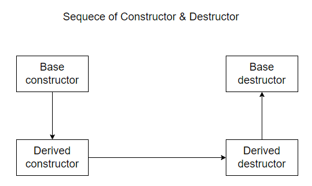

<p align="center">
  
</p>

# 1. Sự khác biệt giữa C & C++

- Đầu tiên phải nhắc đến OOP, ở lập trình C không có tính hướng đối tượng nhưng nó có thể triển khai OOP
  Tham khảo [ở đây](https://www.codementor.io/@michaelsafyan/object-oriented-programming-in-c-du1081gw2)
- C++ cho phép overloading các function và operator
- C++ sử dụng new & delete thay vì malloc/calloc/realloc như trong C

more ... (bổ sung sau)

# 2. Constructor & Destructor là gì ?

## 2.1. Constructor là gì?

**Giới thiệu**

- Constructor là 1 method đặc biệt trong 1 class, có tên trùng với tên của Class chứa nó, method này luôn được thực thi khi 1 class được gọi đến.
- Constructor là 1 method không có kiểu trả về (hiểu sơ sơ giống **void**).
- Constructor có 3 loại: default construct, copy constructor & parameterized constructor (example below).
Copy constructor: `ClassName(const ClassName &old_obj);`
<p align="center">
  
</p>

**Source**

```cpp
#include <iostream>
using namespace std;

// using default constructor
class MyClass {
public:
    int x;
    MyClass() {
        x = 0;
    }
};

// using parameterized constructor
class Rectangle {
private:
    int length;
    int width;

public:
    // Parameterized constructor
    Rectangle(int len, int wid) {
        length = len;
        width = wid;
    }

    int area() {
        return length * width;
    }
};

int main() {
    MyClass obj;
    cout << "Value of x: " << obj.x << endl;

    Rectangle rect1(4, 5);
    Rectangle rect2(7, 3);

    cout << "Acreage of rectangle 1: " << rect1.area() << endl;
    cout << "Acreage of rectangle 2: " << rect2.area() << endl;
    return 0;
}
```

**Source Copy constructor**

```cpp
#include <iostream>

#include "cstring"
using namespace std;

class MyString {
   private:
    char *str;

   public:
    // Constructor
    MyString(const char *s) {
        int length = strlen(s);
        str = new char[length + 1];
        strcpy(str, s);
    }

    // Copy constructor
    MyString(const MyString &source) {
        int length = strlen(source.str);
        str = new char[length + 1];
        strcpy(str, source.str);
    }

    // Destructor
    ~MyString() {
        delete[] str;
    }

    void display() {
        cout << str << endl;
    }
};

int main() {
    MyString str1("Hello");
    MyString str2 = str1;  // Using the copy constructor to create a copy of str1
    str1.display();
    str2.display();

    return 0;
}
```

## 2.2. Destructor là gì?

**Giới thiệu**

- Destructor là 1 method đặc biệt trong 1 class, hay còn gọi là hàm hủy, method này sẽ được tự động gọi khi kết thúc 1 object của 1 class mà chúng ta không cần sử dụng object đấy nữa, vì thế chúng hay được dùng để add các command về free memory hay các tác vụ dọn dẹp giúp chương trình clear hơn.
- Về Syntax thì tên của chúng giống với tên của class chứa nó nhưng có thêm dấu `~` ở trước đó (example below).
- Destructor không thể bị overloading (example below).
  **Source**

```cpp
#include <iostream>
using namespace std;

class MyClass {
   public:
    ~MyClass() {
        cout << "First destructor" << endl;
    }

    // Attempt to overload the destructor (this will cause a compilation error)
    ~MyClass(int x) {
        cout << "Second destructor" << endl;
    }
};

int main() {
    MyClass obj;
    return 0;
}


```

**Output**

```cpp
main.cpp:11:19: error: destructors may not have parameters
     ~MyClass(int x) {
                   ^
main.cpp:11:5: error: 'MyClass::~MyClass()' cannot be overloaded
     ~MyClass(int x) {
     ^
main.cpp:6:5: error: with 'MyClass::~MyClass()'
     ~MyClass() {
     ^
```

# 3. Virtual trong C++

- Trong C++, từ khóa `virtual` đc sử dụng để nói rằng method đấy có thể **override** trong sub class, từ đấy trong các sub class, có thể sử dụng hàm với cùng tham số truyền vào và kiểu trả về.
- Chúng ta có thể dùng virtual cho **constructor** & **destructor** (example below).

**Source**

```cpp
#include <iostream>
using namespace std;

class Base {
   public:
    virtual ~Base() {
        cout << "Base class destructor" << endl;
    }
};

class Derived : public Base {
   public:
    ~Derived() {
        cout << "Derived class destructor" << endl;
    }
};

int main() {
    Base *ptr = new Derived();
    delete ptr;
    return 0;
}
```

<p align="center">
  
</p>

**Output**

```cpp
Base class constructor
Derived class constructor
Derived class destructor
Base class destructor
```

# 4. Overloading & Overriding

| Overloading                                             | Overriding                                           |
| ------------------------------------------------------- | ---------------------------------------------------- |
| Diễn ra trong quá trình compile time                    | Diễn ra trong quá trình runtime                      |
| Thêm action cho method                                  | Thay đổi action của method hiện tại                  |
| Có thể khác nhau về số lượng và kiểu tham số truyền vào | Số lượng và kiểu tham số phải giống nhau             |
| Xảy ra trong cùng 1 class                               | Xảy ra ở 2 hoặc nhiều class có mối quan hệ 'kế thừa' |

## 4.1. Overloading

**Giới thiệu**

- Overloading là 1 kỹ thuật cho phép các method trong cùng 1 class có cùng tên nhưng khác số lượng hoặc kiểu parameter truyền vào.
- Overloading còn được áp dụng cho constructor khi truyền các tham số khác nhau. (example below).
- Overloading có 2 loại: function & operator overloading
<p align="center">
  
</p>

**Source function overloading**

```cpp
#include <iostream>

class OverloadExample {
public:
    // Function to add two integers
    int add(int a, int b) {
        return a + b;
    }

    // Function to add three integers
    int add(int a, int b, int c) {
        return a + b + c;
    }

    // Function to add two doubles
    double add(double a, double b) {
        return a + b;
    }
};

int main() {
    OverloadExample obj;

    std::cout << "Sum of 5 and 7: " << obj.add(5, 7) << std::endl; // Calls the first add function
    std::cout << "Sum of 3, 6, and 9: " << obj.add(3, 6, 9) << std::endl; // Calls the second add function
    std::cout << "Sum of 3.5 and 2.7: " << obj.add(3.5, 2.7) << std::endl; // Calls the third add function

    return 0;
}
```

**Source operator overloading**

```cpp
#include <iostream>
using namespace std;
class Complex {
   private:
    double real;
    double imag;

   public:
    Complex(double r, double i) : real(r), imag(i) {}

    // Overloading the + operator to add two Complex numbers
    Complex operator+(const Complex& other) {
        cout << "call add" << endl;
        return Complex(real + other.real, imag + other.imag);
    }

    // Overloading the - operator to subtract two Complex numbers
    Complex operator-(const Complex& other) {
        cout << "call minus" << endl;
        return Complex(real - other.real, imag - other.imag);
    }

    // Overloading the * operator to multiply two Complex numbers
    Complex operator*(const Complex& other) {
        cout << "call times" << endl;
        return Complex(real * other.real - imag * other.imag, real * other.imag + imag * other.real);
    }

    // Overloading the << operator to output a Complex number
    friend std::ostream& operator<<(std::ostream& os, const Complex& c) {
        os << c.real << " + " << c.imag << "i";
        return os;
    }
};

int main() {
    Complex c1(2.0, 3.0);
    Complex c2(4.0, 1.0);

    Complex sum = c1 + c2;         // Calls the overloaded + operator
    Complex product = c1 * c2;     // Calls the overloaded * operator
    Complex difference = c1 - c2;  // Calls the overloaded - operator

    std::cout << "Sum: " << sum << std::endl;
    std::cout << "Difference: " << difference << std::endl;
    std::cout << "Product: " << product << std::endl;

    return 0;
}
/* Operator overloading sẽ detect các toán tử để lựa chọn method phù hợp trong class */
```

## 4.2. Overriding

**Giới thiệu**

- Overriding là 1 kỹ thuật được sử dụng trong các child class khi kế thừa các parrent class, việc nhiều class kế thừa 1 class dẫn đến cần có kỹ thuật overiding để có thể tái sử dụng method trong parrent class sao cho phù hợp với từng child class (example below).

**Source**

```cpp
#include <iostream>

class Animal {
public:
    virtual void makeSound() {
        std::cout << "Some generic sound" << std::endl;
    }
};

class Dog : public Animal {
public:
    void makeSound() override {
        std::cout << "Woof! Woof!" << std::endl;
    }
};

class Cat : public Animal {
public:
    void makeSound() override {
        std::cout << "Meow! Meow!" << std::endl;
    }
};

int main() {
    Animal* animal1 = new Dog();
    Animal* animal2 = new Cat();

    animal1->makeSound(); // Calls Dog's makeSound method
    animal2->makeSound(); // Calls Cat's makeSound method

    delete animal1;
    delete animal2;

    return 0;
}
```

<!-- End -->

<span style="color: blue;">Cảm ơn các bạn đã đọc bài viết, tài liệu được mình tổng hợp khi tự học, có gì còn thiếu sót hãy thông cảm cho mình nha. Good bye, see yaaa !</span>

<p align="center">
  
</p>
