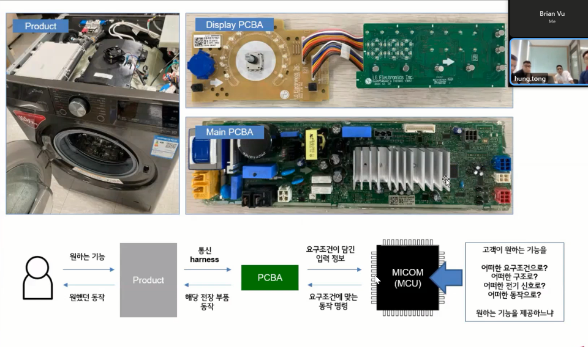

# Buổi 1 - Introduce

- Giới thiệu chung về các thành phần trong máy giặt
  
  Người dùng tương tác với **Display PCBA** (kiểu nút vặn, màn hình cảm ứng ...), sau đấy nó sẽ gửi tín hiệu tới **Main PCBA** để máy giặt thực hiện thao tác của **end-user**.
- Tiếp đến, giới thiệu tổng quan về các chức năng chính của máy giặt: load detection, cấp nước, làm ẩm, heating, rinsing ...

# Buổi 2 - Load Detection

## Ghi chú

Trong máy giặt, "drain pump" (bơm xả) là một thành phần quan trọng để đẩy nước ra khỏi ngăn chứa của máy giặt. Thông số quan trọng liên quan đến "drain pump" có thể bao gồm công suất (Watt), lưu lượng nước bơm ra (lít/phút), áp suất làm việc, và các thông số kỹ thuật khác liên quan đến hiệu suất và khả năng hoạt động của bơm xả.

Trong máy giặt, "dry heater" (bộ sưởi khô) là một thành phần quan trọng để tạo nhiệt độ cần thiết để làm khô quần áo trong quá trình giặt. Các thông số quan trọng liên quan đến "dry heater" có thể bao gồm công suất (Watt), nhiệt độ tối đa có thể đạt được, và các thông số kỹ thuật khác liên quan đến hiệu suất và an toàn khi sử dụng.

Trong một số máy giặt, "filter clean valve" (van làm sạch bộ lọc) là một thành phần được sử dụng để làm sạch bộ lọc của máy giặt. Thông số quan trọng liên quan đến "filter clean valve" có thể bao gồm áp suất làm việc, lưu lượng nước điều khiển, và các thông số kỹ thuật khác liên quan đến việc làm sạch và duy trì hiệu suất của bộ lọc trong quá trình sử dụng.

Trong máy giặt, "circulation pump" (bơm tuần hoàn) là một thành phần quan trọng để tuần hoàn nước giặt trong ngăn chứa của máy giặt.

Trong ngữ cảnh của công nghệ máy giặt, "wash DNN" có thể là viết tắt của "Wash Deep Neural Network" (Mạng nơ-ron sâu cho chức năng giặt).
